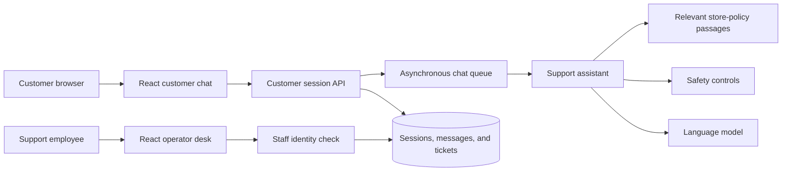
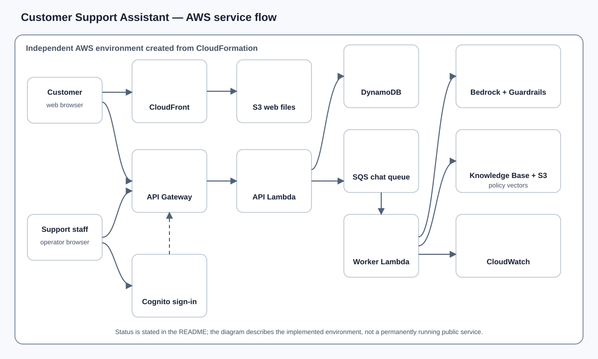

<!-- reader-first-readme:v1 -->

# Customer Support Assistant on AWS

[](https://github.com/abdalrahmanattya/customer-support-chatbot-aws-bedrock/actions/workflows/ci.yml)
[](LICENSE)

Customer Support Assistant gives customers of a fictional online store one
place to ask policy questions and request human help. It answers from the
store's published policies, asks before creating a ticket, and gives authorized
support staff a separate desk for reviewing and resolving those tickets.

The assistant is intentionally limited: artificial intelligence can explain
policy and collect an issue, but it cannot approve refunds, change orders, or
silently take an action on a customer's behalf.

## The 30-second overview

1. A customer asks a question in the web chat.
2. The service finds relevant passages in the store policy and uses Amazon
   Bedrock to write a grounded response.
3. Safety controls block prompt attacks and sensitive identifiers.
4. If the customer needs human help, the assistant summarizes the issue and
   asks for confirmation.
5. Only a confirmed request becomes a persistent support ticket.
6. A support operator signs in, reviews the queue, and moves the ticket from
   open to in progress or resolved.

The same interface can run locally with deterministic sample responses, while
an operator can deploy an independent, short-lived AWS environment for complete
cloud validation.

## Capabilities: what people can do

### Customers

- Ask delivery, return, refund, warranty, and account-policy questions.
- Continue a conversation without losing its context.
- Review a proposed issue before deciding whether to submit it.
- Receive a ticket reference that can be used for follow-up.

### Support staff

- Sign in through a staff-only identity flow.
- Review submitted tickets without seeing another customer's chat session.
- Move tickets through controlled workflow states.
- Inspect operational health without receiving unrestricted infrastructure
  access.

### Operators

- Run the complete browser experience locally without AWS credentials.
- Test 22 behavioral and safety scenarios with repeatable mock responses.
- Create, verify, and remove the AWS environment through bounded scripts or a
  manually dispatched GitHub Actions workflow.

## A representative support journey

A customer asks whether an opened item can be returned. The service searches
the fictional store policies for the most relevant passages, sends those
passages and the question to the language model, and returns an answer grounded
in that source. If the customer says the item arrived damaged, the assistant
collects the useful facts but does not immediately create a ticket.

Instead, it displays a summary and asks the customer to confirm. Confirmation
uses an idempotency key—a unique identifier that prevents a retry from creating
the same ticket twice. The customer receives the resulting reference.

A support employee signs in through the operator page. The API verifies both
the signed identity token and membership of the operator group before returning
the ticket queue. The employee can then accept the ticket and mark it resolved.
Customer sessions and operator permissions remain separate throughout the
journey.

## Product and safety boundaries

- Policy answers must be grounded in the supplied fictional policy document.
- Ticket creation always requires explicit customer confirmation.
- The assistant cannot issue refunds, update orders, send email, take payments,
  or connect to a real commerce platform.
- Local checks and Amazon Bedrock Guardrails reject prompt attacks, unsafe
  content, passwords, payment-card numbers, and US Social Security numbers.
- Customer access uses short-lived opaque session tokens. Staff access uses
  Amazon Cognito sign-in plus an independently checked operator-group claim.
- Request limits, queue retries, a dead-letter queue, short data retention, and
  deployment expiry constrain misuse and runaway cost.
- Logs record operational events without intentionally recording credentials or
  unrestricted conversation content.

## System architecture: from question to resolution



In plain language, the browser sends a message to a short-lived customer
session. The API saves the request and places it on a queue, which lets the
browser poll for a result instead of keeping one connection open while the
model responds. A worker finds relevant policy text, applies safety checks,
asks the model for an answer, and stores the result. Ticket creation is a
separate confirmation step. The operator desk reaches the same records only
after staff identity and group membership are verified.

## Technology guide in plain English

| Technology | Its job in this product |
| --- | --- |
| React | Builds the customer chat and support-staff desk in the browser. |
| Python | Implements conversation rules, retrieval, safety checks, ticket workflows, cloud functions, evaluations, and the command-line client. |
| Amazon Bedrock | Provides managed access to the language and embedding models used for answers and policy search. |
| Bedrock Knowledge Bases | Finds policy passages that are relevant to a customer's question. |
| Bedrock Guardrails | Applies managed content and sensitive-information filters before or around model use. |
| Amazon API Gateway | Exposes the application's HTTPS endpoints to the browser. |
| AWS Lambda | Runs the API and background chat worker without permanent servers. |
| Amazon SQS | Holds chat work for background processing and retries failures safely. |
| Amazon DynamoDB | Stores sessions, messages, tickets, workflow state, and expiry timestamps. |
| Amazon Cognito | Signs in support staff and supplies verifiable identity claims. |
| Amazon S3 and S3 Vectors | Store the web files, fictional policy source, and searchable policy vectors. |
| Amazon CloudFront | Delivers the private S3-hosted web application over HTTPS. |
| Amazon CloudWatch | Collects logs, metrics, and alarms for operating the environment. |
| CloudFormation | Defines the AWS resources as reviewable infrastructure code. |

## AWS cloud-resources architecture



The customer and operator applications are delivered through CloudFront from a
private S3 bucket. Both call API Gateway, which sends requests to the API
Lambda function. Customer chat work moves through SQS to a worker Lambda. That
worker uses Bedrock, Guardrails, and a Knowledge Base backed by policy documents
and vectors in S3. DynamoDB holds durable product records, Cognito authenticates
staff, and CloudWatch provides operational signals.

The diagram uses unchanged
[official AWS Architecture Icons](https://aws.amazon.com/architecture/icons/).
Local copies and usage notes are in the
[icon provenance record](docs/diagrams/assets/README.md).

To use AWS mode, an operator creates an independent environment in their own
AWS account. The architecture was exercised successfully in `us-east-1` on
2026-09-08, including grounded chat, confirmed ticket creation, staff sign-in,
ticket handling, operational checks, and ordered cleanup. This repository does
not point to a shared public instance.

### Deployment status

The planned AWS resources are not currently deployed. A future operator creates
the components shown above in the operator's account.

## What was tested

The current verification covers:

- 42 Python tests for conversation behavior, policy grounding, safety,
  authorization, persistence, ticket confirmation, idempotency, infrastructure,
  and runtime handlers.
- A 22-case deterministic behavioral and safety evaluation.
- React component tests, TypeScript checking, and a production build.
- Browser journeys for both the customer and authenticated operator paths.
- CloudFormation linting and infrastructure contract checks.
- A complete AWS lifecycle: deployment, Knowledge Base ingestion, customer
  chat, ticket persistence, authenticated operator work, alarms and health,
  teardown, and a scoped absence check.
- Continuous integration for backend, infrastructure, web, dependency audit,
  and public-repository safeguards.

The dated [AWS lifecycle record](docs/verification/aws-lifecycle-2026-09-08.md)
separates live evidence from local simulation. Mock evaluation demonstrates
business behavior; it does not prove current model quality or AWS availability.

## Important limitations

- Every store policy, customer, and ticket is fictional.
- The product has no real order, payment, refund, email, or customer-record
  integration.
- Local browser mode stores its sample state in the browser and is visibly
  labelled as simulation.
- Model, Knowledge Base, Guardrail, and S3 Vectors availability varies by AWS
  Region; the verified path targets `us-east-1`.
- Language-model output can still be incomplete or incorrect. Grounding and
  safety controls reduce risk but do not eliminate it.
- Deployment expiry rejects new sessions but does not remove resources;
  teardown is required to stop storage and distribution costs.
- DynamoDB point-in-time recovery is disabled and retention is deliberately
  short for this disposable environment.
- One successful lifecycle does not prove continuous availability, scale, or
  long-term operational reliability.
- Live Bedrock requests depend on account permissions, quotas, latency, model
  access, and usage charges.

## Run locally

This section is for someone operating or changing the application. A
non-technical reader can stop here without missing the product explanation.

### Prerequisites

- Python 3.12 or newer
- Node.js 24.15 or newer and npm
- Git

No AWS credentials are needed for local mock mode.

### 1. Install and verify the backend

```sh
python3 -m venv .venv
source .venv/bin/activate
python -m pip install -e '.[dev]'
pytest
ruff check backend evals
cfn-lint infra/*.yaml
./scripts/run-eval.sh --mock
```

### 2. Start the browser application

```sh
npm ci
npm run web:dev
```

Open the local address printed by Vite. The interface clearly identifies local
demo mode. Its data is simulated and remains in browser storage.

The terminal alternative is:

```sh
python -m support_service.cli --mock
```

### 3. Run the web checks

```sh
npm run web:test
npm run web:build
npm run web:e2e
```

See [local development](docs/operations/local-development.md) for environment
variables, test boundaries, and troubleshooting.

## Exact deployment method: deploy, verify, and remove an AWS environment

AWS mode creates billable resources. Use temporary credentials, confirm the
account and Region before every mutation, and follow the complete
[AWS operations guide](docs/operations/aws-deployment.md).

```sh
source <(./scripts/refresh-credentials.sh)
aws sts get-caller-identity
./scripts/deploy.sh demo us-east-1
./scripts/verify-deployment.sh demo us-east-1
./scripts/teardown.sh demo us-east-1 customer-support-assistant-demo
```

The deployment script builds the Lambda package, uploads it to a private
artifact bucket, creates the CloudFormation stack, ingests the policy source,
builds the React application from stack outputs, and publishes it through
CloudFront. Verification exercises the deployed product and records sanitized
results. Teardown requires the exact environment and stack names, empties
stack-owned buckets, deletes the stack, removes only that environment's
artifacts, and checks for residual resources.

The same lifecycle is available through the manually dispatched **AWS demo
lifecycle** GitHub Actions workflow using a short-lived OpenID Connect (OIDC)
identity. Ordinary pushes and pull requests run tests only; they do not deploy
or remove AWS resources.

If deployment fails, do not start another environment blindly. Inspect the
CloudFormation events, preserve sanitized diagnostics, correct the reviewed
template or configuration, and either retry the same stack or run the exact
teardown command. Cleanup permanently deletes the environment's stored sessions,
tickets, policy data, and web files.

## Repository map

| Location | Contents |
| --- | --- |
| `apps/web` | React customer chat, operator desk, AWS client, and browser tests. |
| `backend/src/support_service` | Conversation engine, product services, persistence adapters, Lambda handlers, and CLI. |
| `backend/tests` | Backend, infrastructure, authorization, and product tests. |
| `knowledge` | Fictional store policy source and synthetic fixtures. |
| `evals` | Behavioral and safety cases plus local and live runners. |
| `infra` | CloudFormation definition for the complete AWS environment. |
| `scripts` | Local evaluation and bounded AWS lifecycle commands. |
| `tests/e2e` | Customer and operator browser acceptance journeys. |
| `docs/architecture` | Component, API, data-flow, and trust-boundary details. |
| `docs/operations` | Local, AWS, security, cost, rollback, and cleanup guidance. |
| `docs/verification` | Verification policy and dated sanitized evidence. |

Security reports should follow [SECURITY.md](SECURITY.md). Contributions should
follow [CONTRIBUTING.md](CONTRIBUTING.md).

Licensed under the [MIT License](LICENSE).
