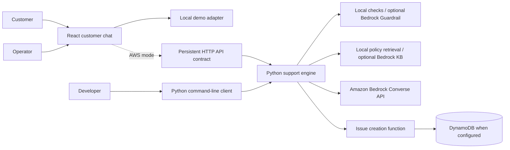
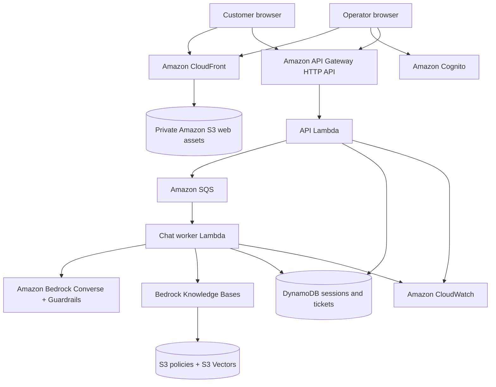

# Customer Support Assistant on AWS

An AWS-native support application for a fictional online store. The product is
being developed as two connected experiences: a customer chat that answers
policy questions and captures support issues, and an authenticated operations
desk where staff can review and resolve submitted tickets.

## Purpose

Provide a small, reproducible support workflow that demonstrates grounded AI
answers, controlled escalation, and operator ticket handling on AWS.

## Current capabilities

- Python conversational engine using the Amazon Bedrock Converse API
- Local policy retrieval with optional Bedrock Knowledge Base retrieval
- Structured intent classification and issue extraction
- DynamoDB-backed issue creation function
- Configurable Bedrock Guardrails integration with local safety checks
- Responsive React customer chat and authenticated operator desk
- Persistent session, queued chat, confirmation-gated ticket, and operator API
  services with in-memory and DynamoDB adapters
- Offline tests and a 22-case behavioral evaluation suite
- CloudFormation templates for the existing experimental resources

The browser application is complete for local demonstration. Its complete
disposable AWS deployment is planned and is not represented as deployed.

## Why it is useful

Customers can receive answers grounded in published store policies and turn a
conversation into a trackable issue when automation is insufficient. Operators
will get a small queue for progressing issues from open to resolved. The
deployment is designed for short demonstrations and complete teardown, keeping
idle AWS cost close to zero.

## Current system architecture



## Planned cloud-resources architecture diagram



## Repository layout

```text
apps/web/                   React customer and operator application
backend/src/support_service Python service, Lambda handlers, and CLI
backend/tests/              Backend unit and integration tests
knowledge/policies/         Fictional store policy source
knowledge/fixtures/         Synthetic demonstration data
evals/cases/                Behavioral and safety scenarios
evals/runners/              Offline and live evaluation tools
infra/                      AWS CloudFormation/SAM infrastructure
scripts/                    Local and cloud lifecycle commands
tests/e2e/                  Browser acceptance journeys
docs/                       Architecture, operations, and verification records
```

## Run locally

Python 3.12 or newer is required.

```bash
python3 -m venv .venv
source .venv/bin/activate
python -m pip install -e '.[dev]'
pytest
ruff check backend evals
cfn-lint infra/*.yaml
./scripts/run-eval.sh --mock
```

Run the browser application in explicit local demo mode:

```bash
npm install
npm run web:dev
```

Run the terminal client with `python -m support_service.cli --mock`.

Mock mode is a local simulation. It is not evidence that AWS services or live
persistence are working.

## Exact deployment method

The repository does not yet contain the complete product deployment shown
above. Existing templates under `infra/` cover only the earlier issue-storage,
guardrail, knowledge-document, and evaluation resources. They will be replaced
by a cohesive disposable deployment.

The intended workflow is:

```bash
source <(./scripts/refresh-credentials.sh)
./scripts/deploy.sh demo us-east-1
./scripts/teardown.sh demo us-east-1
```

These commands are not live deployment evidence until the verification report
records a successful deploy, acceptance run, and teardown.

## Deployment status

No current AWS deployment is claimed. The local application baseline is
implemented and tested; the complete AWS architecture is planned. A read-only
AWS inventory will reconcile resources from earlier work before a new
deployment is authorized.

No AWS resources are currently deployed; all AWS resources in the cloud diagram are planned until a live verification record states otherwise.

## Limitations

- Local browser demo data is stored only in browser storage and is clearly
  labeled as simulation; AWS mode uses the persistent HTTP API.
- The operator interface includes Cognito PKCE sign-in, but its user pool and
  deployed callback configuration are planned for the infrastructure phase.
- The current knowledge template does not provision a complete managed vector
  knowledge base.
- Offline evaluation uses deterministic simulation and is not a model-quality
  or cloud-availability measurement.
- The fictional product does not connect to commerce, payment, email, or order
  systems.
- Live Bedrock use depends on model availability, quotas, latency, and charges.

## Documentation

- [Architecture](docs/architecture/README.md)
- [Local development](docs/operations/local-development.md)
- [Verification policy](docs/verification/README.md)

## License

This project is available under the MIT License.
