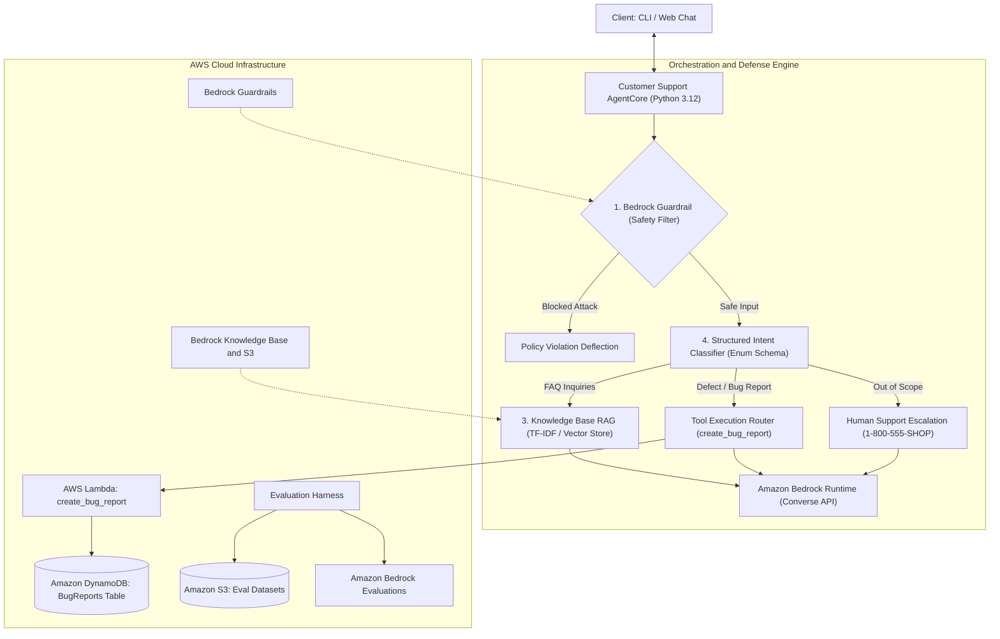
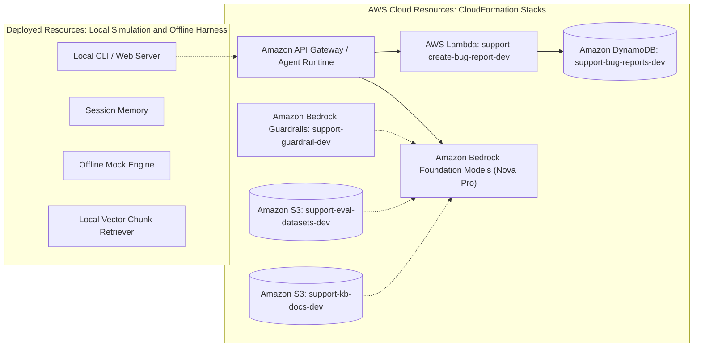

# Customer Support Chatbot (AWS Bedrock AgentCore)

## Purpose
This service provides an intelligent, automated customer support assistant that utilizes foundation models hosted on **Amazon Bedrock** (using the Bedrock AgentCore & Converse API architecture) to resolve user inquiries, ground answers in official knowledge base FAQs via RAG, capture structured defect/bug reports via automated tool execution, defend against prompt attacks with Bedrock Guardrails, and escalate complex requests to human customer support.

## Capabilities
- **Multi-Turn Conversational Assistance**: Stateful conversation tracking with conversational context window trimming and session memory.
- **Intelligent Knowledge Base RAG Grounding**: Dynamic semantic vector search over policy documents for orders, shipping, payment, refund, and account queries without hallucinations.
- **Interactive Bug Reporting & Tool Calling**: Extracts necessary defect parameters (`description`, `stepsToReproduce`, `environment`), asks follow-up clarification questions for missing details, and persists confirmed tickets in Amazon DynamoDB.
- **Pre-Inference Safety Guardrails**: Intercepts prompt injection attacks, jailbreaks (e.g. DAN prompts), toxic content, and sensitive PII before model inference.
- **Structured Intent Classification**: Deterministic classification enforcing strict enum boundaries (`BUG_REPORT`, `PLATFORM_QUESTION`, `OTHER_REQUEST`) via Bedrock tool forcing.
- **Web Chat UI & Interactive CLI**: Clean web browser interface with real-time tool badges and terminal CLI client.
- **Out-of-Scope Deflection & Escalation**: Politely redirects non-support inquiries to live human support agents (via contact form or phone line `1-800-555-SHOP`).
- **Automated Evaluations**: 22-case golden evaluation dataset and LLM-as-a-judge benchmarking producing Bring Your Own Inference (BYOI) JSONL for Amazon Bedrock Evaluations.
- **Offline Mock Simulation**: Full local developer experience and unit test suite (26 tests) that can run completely offline without cloud credentials.

## Usefulness
Automates high-volume routine customer support requests, substantially lowers response latency, provides 24/7 customer assistance availability, maintains consistent policy-aligned answers, blocks adversarial prompt attacks, and captures structured bug tickets directly into engineering databases.

## How it works
The client application submits customer messages to the Customer Support AgentCore engine. The safety guardrail filters malicious inputs, the classifier evaluates conversational intent, the RAG retriever injects relevant top-K knowledge chunks, and the agent initiates structured tool calls when bug reports are detected, invoking Amazon Bedrock foundation models (Amazon Nova Pro / Anthropic Claude) over the Converse API.

### System architecture diagram


## Exact deployment method

### 1. Local Development & Offline Testing (No Cloud Credentials Required)
You can develop, test, and interact with the chatbot entirely offline using the local mock harness:

```bash
# Create and activate virtual environment
python3 -m venv .venv
source .venv/bin/activate

# Install dependencies in editable mode
pip install -e .

# Run unit and integration tests (26 test cases)
pytest tests/ -v

# Run CloudFormation template linter
cfn-lint infrastructure/*.yaml

# Run the automated 22-case evaluation suite
./scripts/run-eval.sh --mock

# Start Web Chat UI in offline mock mode
python -m src.web.server --mock --port 8000
```

### 2. Deploy Infrastructure to AWS via CloudFormation
Once temporary or permanent AWS credentials are configured, provision the infrastructure:

```bash
# Configure AWS Credentials
export AWS_REGION="us-east-1"
export AWS_ACCESS_KEY_ID="<your-access-key>"
export AWS_SECRET_ACCESS_KEY="<your-secret-key>"
export AWS_SESSION_TOKEN="<your-session-token>"

# Deploy CloudFormation stacks (DynamoDB table, Lambda function, IAM roles, S3 eval bucket)
./scripts/deploy.sh dev us-east-1

# Launch Web Chat UI connected to live Bedrock & Lambda
./scripts/start-web.sh 127.0.0.1 8000

# Launch live Bedrock interactive CLI session
python -m src.cli.chat --model amazon.nova-pro-v1:0

# Run evaluation suite against live AWS Bedrock model
./scripts/run-eval.sh --live
```

### 3. Teardown Cloud Resources
To remove deployed AWS resources and avoid ongoing charges:

```bash
./scripts/teardown.sh dev us-east-1
```

### Cloud-resources diagram


## Deployment status
The service infrastructure is currently deployed in `us-east-1` across CloudFormation stacks. DynamoDB bug ticket storage (`support-bug-reports-dev-us-east-1`) and Lambda tool execution (`support-create-bug-report-dev`) are deployed and active, while advanced autonomous multi-agent hosting stacks remain planned for future expansions.

## Limitations
- **Token Context Trimming**: Conversation history is capped and trimmed to the most recent turns to maintain token efficiency and prevent context exhaustion.
- **Model Quotas & Latency**: Live cloud performance depends on AWS Bedrock foundation model regional quotas and cold-start latency for tool-calling Lambda functions.
- **Exact Field Matching**: Bug report tool invocation requires `description`, `stepsToReproduce`, and `environment`; the agent will ask clarifying questions until all required fields are provided.
