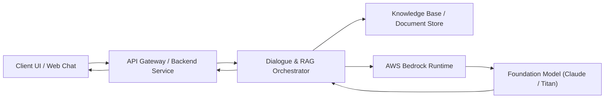
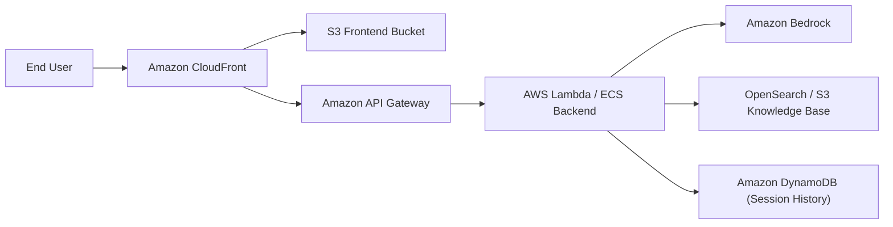

# Customer Support Chatbot (AWS Bedrock)

## Purpose
This service provides an intelligent, automated customer support assistant that utilizes foundation models hosted on AWS Bedrock to resolve user inquiries, retrieve knowledge base articles, and escalate complex requests.

## Capabilities
- Multi-turn conversational assistance with contextual memory.
- Intelligent knowledge base search and retrieval-augmented generation (RAG).
- Intent classification and automated deflection of common tier-1 support tickets.
- Fallback escalation routing for complex or unresolved customer issues.
- Structured response validation and session conversation logging.

## Usefulness
Automates high-volume routine customer support requests, substantially lowers response latency, provides 24/7 customer assistance availability, and maintains consistent policy-aligned answers.

## How it works
The client application submits customer messages to the backend service. The service analyzes user intent, queries the knowledge base for relevant context, constructs prompt templates, invokes AWS Bedrock foundation models, and validates the generated response before returning it to the user.

### System architecture diagram


## Exact deployment method
From a clean repository checkout, configure the required environment variables and deploy the application and infrastructure using the deployment automation scripts:

```bash
# 1. Install dependencies
# 2. Run local tests and linters
# 3. Deploy infrastructure via Terraform/CDK (planned)
```

### Cloud-resources diagram


## Deployment status
The service is currently initialized for local development and testing; AWS cloud resources are planned and not deployed.

## Limitations
- Model token context windows constrain conversation history length.
- Subject to AWS Bedrock service quotas and regional foundation model availability.
- Dynamic tool-use latency is dependent on upstream API response times.
