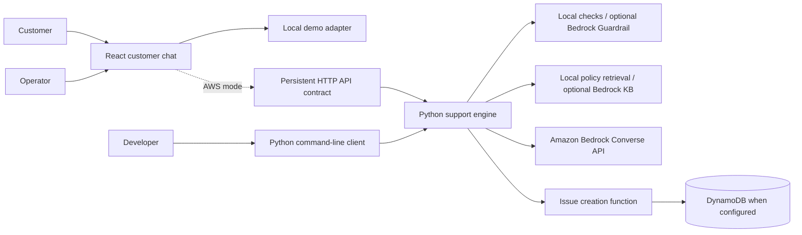
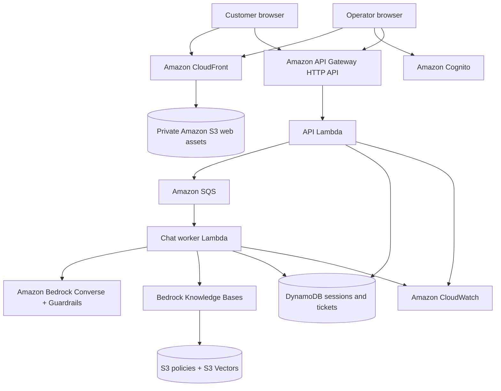

# Customer Support Assistant on AWS

[](https://github.com/abdalrahmanattya/customer-support-chatbot-aws-bedrock/actions/workflows/ci.yml)
[](LICENSE)

An AWS-native support application for a fictional online store. The product is
being developed as two connected experiences: a customer chat that answers
policy questions and captures support issues, and an authenticated operations
desk where staff can review and resolve submitted tickets.

## Purpose

Provide a small, reproducible support workflow that demonstrates grounded AI
answers, controlled escalation, and operator ticket handling on AWS.

## Current capabilities

- Python conversational engine using the Amazon Bedrock Converse API
- Local policy retrieval with optional Bedrock Knowledge Base retrieval
- Structured intent classification and issue extraction
- DynamoDB-backed issue creation function
- Configurable Bedrock Guardrails integration with local safety checks
- Responsive React customer chat and authenticated operator desk
- Persistent session, queued chat, confirmation-gated ticket, and operator API
  services with in-memory and DynamoDB adapters
- Offline tests and a 22-case behavioral evaluation suite
- One cohesive CloudFormation deployment for the complete serverless product
- Manual-only GitHub OIDC deployment and exact-target teardown automation
- Deployment expiry, request limits, throttles, short retention, and alarms

The application and disposable AWS deployment path are implemented and locally
validated. A bounded live lifecycle has also passed and was torn down; no live
AWS deployment is currently claimed.

## Why it is useful

Customers can receive answers grounded in published store policies and turn a
conversation into a trackable issue when automation is insufficient. Operators
will get a small queue for progressing issues from open to resolved. The
deployment is designed for short demonstrations and complete teardown, keeping
idle AWS cost close to zero.

## Current system architecture



## Implemented cloud-resources architecture (not currently deployed)



## Repository layout

```text
apps/web/                   React customer and operator application
backend/src/support_service Python service, Lambda handlers, and CLI
backend/tests/              Backend unit and integration tests
knowledge/policies/         Fictional store policy source
knowledge/fixtures/         Synthetic demonstration data
evals/cases/                Behavioral and safety scenarios
evals/runners/              Offline and live evaluation tools
infra/                      AWS CloudFormation/SAM infrastructure
scripts/                    Local and cloud lifecycle commands
tests/e2e/                  Browser acceptance journeys
docs/                       Architecture, operations, and verification records
```

## Run locally

Python 3.12 or newer is required.

```bash
python3 -m venv .venv
source .venv/bin/activate
python -m pip install -e '.[dev]'
pytest
ruff check backend evals
cfn-lint infra/*.yaml
./scripts/run-eval.sh --mock
```

Run the browser application in explicit local demo mode:

```bash
npm install
npm run web:dev
```

Run the terminal client with `python -m support_service.cli --mock`.

Mock mode is a local simulation. It is not evidence that AWS services or live
persistence are working.

## Exact deployment method

Use temporary STS credentials, verify the assumed identity, and run the cohesive
deployment:

```bash
source <(./scripts/refresh-credentials.sh)
aws sts get-caller-identity
./scripts/deploy.sh demo us-east-1
./scripts/verify-deployment.sh demo us-east-1
./scripts/teardown.sh demo us-east-1 customer-support-assistant-demo
```

The deploy command builds and uploads the Lambda artifact, provisions the stack,
ingests the policy source, builds the React application from stack outputs, and
publishes it behind CloudFront. The teardown command requires the exact stack
name. See [AWS deployment and teardown](docs/operations/aws-deployment.md).

## Deployment status

No current AWS deployment is claimed. The local product and infrastructure are
implemented and tested. A bounded AWS deploy, ingestion, grounded chat, ticket,
authenticated operator, operational review, teardown, and absence check passed
on 2026-09-08. The two legacy orphans identified during readiness were deleted
after their absent dependencies were rechecked.

All resources in the cloud diagram are implemented as infrastructure code but
remain planned, not deployed, until a live verification record states
otherwise. Planned resources are not deployment evidence.

## Limitations

- Local browser demo data is stored only in browser storage and is clearly
  labeled as simulation; AWS mode uses the persistent HTTP API.
- S3 Vectors, Bedrock Knowledge Bases, and model availability vary by Region;
  the deployment currently targets `us-east-1`.
- Deployment expiry rejects new sessions but does not delete resources; teardown
  is still required to stop residual storage and distribution costs.
- The stack and scripts are locally validated but have not yet completed a live
  deploy/acceptance/teardown cycle in this modernization.
- Offline evaluation uses deterministic simulation and is not a model-quality
  or cloud-availability measurement.
- The fictional product does not connect to commerce, payment, email, or order
  systems.
- Live Bedrock use depends on model availability, quotas, latency, and charges.

## Documentation

- [Architecture](docs/architecture/README.md)
- [Local development](docs/operations/local-development.md)
- [AWS deployment and teardown](docs/operations/aws-deployment.md)
- [Security, cost, and failure controls](docs/operations/security-and-cost.md)
- [Verification policy](docs/verification/README.md)
- [AWS readiness review](docs/verification/aws-readiness-2026-09-08.md)
- [AWS lifecycle verification](docs/verification/aws-lifecycle-2026-09-08.md)
- [Contributing](CONTRIBUTING.md)
- [Security policy](SECURITY.md)

## License

This project is available under the MIT License.
