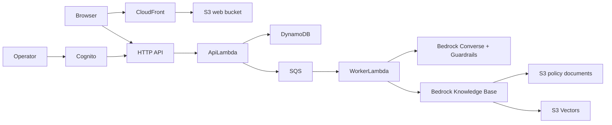

# Architecture

The implementation has two deliberate runtime modes. Local demo mode keeps all
browser data on the device and makes no cloud claims. AWS mode is a disposable
serverless application with a static React client, asynchronous chat processing,
managed retrieval, persistent sessions and tickets, and Cognito-protected
operator APIs.

The HTTP API accepts customer work through short-lived opaque session tokens.
Chat runs asynchronously so model latency and retries do not hold open a browser
request. SQS retries failures and moves exhausted work to a dead-letter queue.
The worker retrieves policy chunks, applies safety controls, invokes the model,
and persists the result for polling. Ticket creation is a separate
review-and-confirm workflow and uses idempotency keys.

The operator path uses Cognito Authorization Code + PKCE. API Gateway validates
the JWT while the backend independently requires the `operators` group. Public
registration is disabled.

CloudFormation owns the product resources in one stack. A small private S3
bucket outside the stack bootstraps Lambda artifacts and is shared across demo
environments. Teardown empties stack-owned buckets before deletion and removes
only the selected environment's artifacts.

The root README contains the canonical status diagram. All cloud components are
implemented but remain not deployed until a live verification record proves the
specific stack state.
