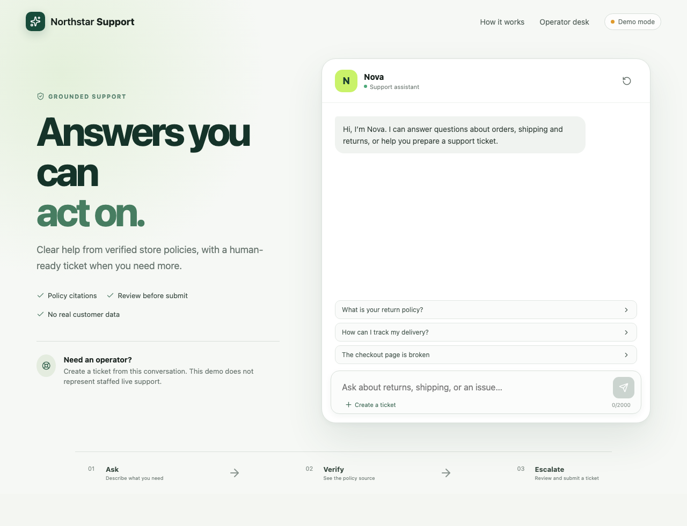

# Verification

Verification has three evidence levels:

1. **Offline:** tests, lint, templates, and deterministic evaluation without
   deployed AWS resources.
2. **Live:** bounded checks against an approved deployment, recording actual
   behavior, latency, and usage.
3. **Lifecycle:** deploy, seed, validate, capture sanitized evidence, teardown,
   redeploy, smoke test, and verify final resource removal.

Only current, sanitized evidence belongs in this directory. Mock results must
always be labeled as simulation.

The Phase 5 infrastructure acceptance gate is local: backend tests, frontend
tests/build, browser journeys, Ruff, `cfn-lint`, shell parsing, and the Main
publication checker. It does not establish that AWS accepts every account- and
Region-specific resource. Live acceptance requires stack deployment, successful
knowledge ingestion, customer and operator journeys, alarm/log review, teardown,
and a read-only absence check.

## Local interface evidence

The image below was captured from the Phase 4 React application in explicit
local demo mode. It demonstrates the responsive customer interface only; it is
not evidence of an AWS deployment.

