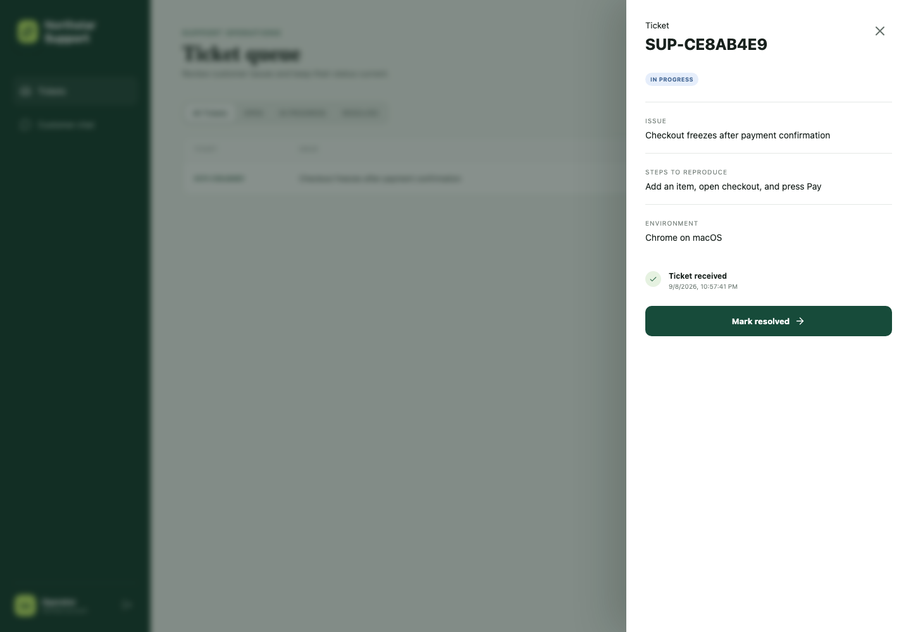

# AWS lifecycle verification — 2026-09-08

This record describes a bounded live deployment in `us-east-1`. The deployment
has been deleted; the endpoints recorded during the run are no longer active.
All customer, ticket, and operator data used below was synthetic.

## Accepted behavior

- CloudFormation created the complete stack and later applied a corrective
  update successfully.
- The policy document was ingested into a Bedrock Knowledge Base backed by S3
  Vectors. A direct retrieval returned the relevant return/refund policy chunk.
- A live Nova Pro conversation answered that returns are accepted within 30 days
  and refunds usually take 3–10 business days. The stored result contained three
  Knowledge Base citations.
- A customer created a draft, explicitly confirmed it, and read the resulting
  `OPEN` ticket through the session-scoped API.
- An unauthenticated operator request returned HTTP 401.
- A synthetic Cognito operator completed Authorization Code + PKCE sign-in in an
  isolated browser and moved the ticket from `OPEN` to `IN_PROGRESS` to
  `RESOLVED`. DynamoDB independently confirmed the final state.
- The public health route and CloudFront application returned HTTP 200.
  CloudFront returned HSTS, same-origin framing, strict referrer, and MIME-sniff
  protection headers.
- Both the API-error and dead-letter alarms were `OK`; the primary queue and DLQ
  were empty before teardown.

The first live chat exposed an IAM defect before acceptance: the US Nova Pro
inference profile can route to three US Regions while the worker initially
allowed foundation-model ARNs only in the stack Region. The request failed with
the documented safe public error. The role scope was corrected to foundation
models in any Region while retaining account-scoped inference-profile resources.
Server-side exception logging and worker failure semantics were
also improved, the stack was updated, and the complete chat journey then passed.

## Visual evidence

The operator screenshot shows the synthetic ticket at the intermediate
`IN_PROGRESS` step with the next explicit action available. It contains no real
customer or operator information. The final `RESOLVED` state was verified from
DynamoDB before teardown.

## Teardown evidence

Exact-name teardown deleted the stack after emptying its S3 buckets.
CloudFormation reported successful deletion of the Knowledge Base, data source,
S3 vector index and vector bucket, Guardrail, API, Lambdas, queues, table,
Cognito resources, CloudFront distribution, alarms, logs, and IAM roles. The
empty bootstrap artifact bucket was then deleted explicitly.

A final read-only inventory found no active resource belonging to this
application. Support-named resources belonging to a separate application and
the AWS-managed Support service role were excluded and left unchanged. No live
deployment is currently claimed.
